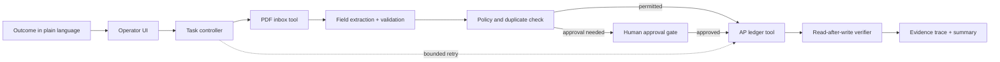

# CentrAlign Operator Lab

An autonomous invoice intake proof of concept for the CentrAlign AI engineering exercise. It takes an outcome in plain language and performs a bounded, inspectable workflow: locate an invoice PDF, extract its fields, apply company policy, write to an AP ledger, recover from a transient failure, and verify the result.

**This is a local demo with synthetic documents and a simulated finance system.** It does not connect to real company accounts, send payments, or make external writes.

## Run it

Requires Python 3.10+.

```powershell
py -m venv .venv
.venv\Scripts\Activate.ps1
python -m pip install -r requirements.txt
streamlit run app.py
```

Open the local URL printed by Streamlit. The three synthetic, text-based sample invoices are checked into `data/inbox/`. By default, run the Northstar task with **Simulate one connector timeout** enabled. The trace shows extraction, a transient failure, a bounded retry, the write, and a read-after-write verification. The AP ledger is created at `data/ledger.json` on the first successful run. Use **Inspect the local accounts payable ledger** to see the stored evidence.

To exercise the human gate, request the Meridian Cloud invoice (₹126,500). Without **Approve high-value invoice** the worker stops before writing. Turn the control on and run again to authorize the write. Request an already recorded invoice to see duplicate detection skip the write.

To regenerate the sample PDFs after changing `make_samples.py`, run `python make_samples.py`.

## Architecture



- `app.py` is the Streamlit operator console: task input, company context, approval and failure controls, event trace, and ledger inspection.
- `worker.py` owns the task loop and explicit tools. It selects a matching sample invoice, extracts and validates vendor, invoice number, amount, currency, and ISO due date from actual PDF text, checks the ledger, and controls execution.
- `data/inbox/` contains generated sample PDFs. `data/ledger.json` is the simulated system of record and persists between app runs.
- `make_samples.py` generates the synthetic invoice fixtures.

## Technical decisions

**Narrow workflow, actual execution.** Invoice intake demonstrates a meaningful end-to-end business outcome rather than a broad collection of mocked computer controls. The worker reads real PDF files and persists a real local ledger record.

**Deterministic control plane.** The exercise does not require a specific model. This prototype deliberately uses a small policy-driven controller rather than an LLM to choose privileged actions. It is easier to inspect and reproduce, and its approval threshold, duplicate rule, and retry budget are explicit. Natural-language input is used to identify the vendor; the worker determines and executes the remaining steps. This trades open-ended language coverage for predictable behavior.

**Idempotency and bounded recovery.** Invoice number is the idempotency key. A retry first rechecks the ledger, so repeating a write cannot create a second bill. Only one retry is allowed for the simulated transient connector timeout; extraction, validation, or verification errors stop safely.

**Policy before side effect.** High-value invoices pause before ledger writes. Approval is an explicit operator action in this isolated demo. The local ledger has no payment capability.

**Evidence as an output.** The trace records the plan, chosen file, extracted values, recovery decisions, ledger ID, and read-back verification. Completion is reported only after the saved record matches the invoice key and record ID.

## Demo walkthrough

1. Start with the default Northstar request and leave the transient timeout simulation on.
2. Run the operator. Point out that the retry is bounded and uses the invoice number as its idempotency key.
3. Show the read-after-write verification and inspect `BILL-0001` in the ledger.
4. Run the Northstar request again to show duplicate detection and no second write.
5. Change the request to “Process the latest invoice from Meridian Cloud Services, extract the amount and due date, and enter it in accounts payable.” Run without approval to show the policy pause; enable approval and rerun to complete.

The Streamlit page is the live demo. A separate hosted demo/video is not included because the deliverable is self-contained and uses only local synthetic data.

## Assumptions

- “Latest” means the newest matching PDF in the local inbox. The bundled files are samples; a production inbox needs a trusted timestamp and source connector.
- Invoices use searchable text and labeled fields. Currency symbols map to a small set of ISO currency codes.
- Invoice number uniquely identifies a bill within this single-company demo ledger.
- ₹100,000 is a sample policy threshold chosen for the demo, not a CentrAlign policy.
- The simulated connector failure is deliberate and occurs once per task run when enabled.

## Limitations and next steps

- Vendor matching and field extraction are deliberately narrow and rely on text labels. Scanned PDFs, OCR, varied layouts, ambiguous vendors, and multi-invoice requests are unsupported.
- There is no LLM planner, company memory store, background queue, authentication, multi-tenant isolation, or production accounting connector. The approval toggle demonstrates a gate, but not a secure identity-bound approval workflow.
- The sample failure is injected locally; it is not a live external integration failure. The single JSON ledger is suitable for a demo, not concurrent production use.
- A production iteration should add a real read-only inbox connector, schema-based extraction with evidence spans, a tenant-scoped policy and memory store, signed human approvals, durable job orchestration, connector contracts, and replayable audit events. Build a task evaluation set before widening workflow coverage.

## Components

- Python, Streamlit, PyMuPDF, ReportLab.
- No model, external API, credentials, or third-party service is used at runtime.
- Google Fonts are requested by the browser for optional visual styling; the application itself runs locally without them.
